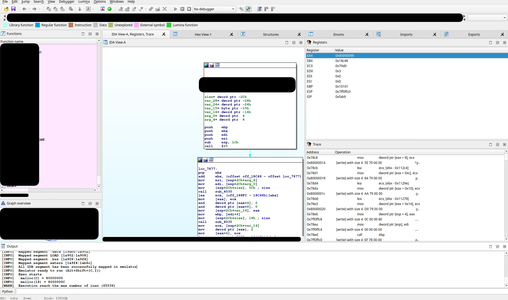

# EWS 

Emulator Wrapper Solution. 
It's a plugin that aims to integrate emulation features (such as debugger) 
from various emulator (currently unicorn, but you can add more). 

**Code is currently in refactoring, please stay tuned for a stable release**. 

## An example 

 

